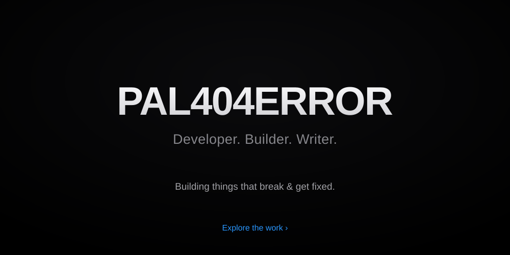

  

  
  
  

---

### 👤 About

> Building things that break and get fixed. Startup enthusiast. Writing what others are afraid to say.

  
  
  

---

### ⚡ Tech

  
  
  
  
  
  
  

---

### 📊 Stats

  
  

  

<i>“Keep breaking things, keep fixing them.”</i>

